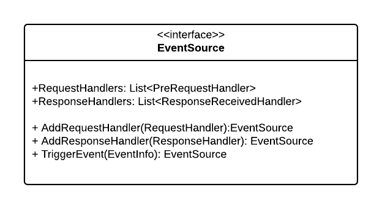

# Okta Python SDK v3
## (Draft) Technical Docs

Beginning with version 3, the Okta Python SDK is generated using the [open-api-generator](https://openapi-generator.tech/).  

# Overview

In order to inject custom functionality into the request and response pipeline the templates used by the generator have been modified to emit events that a consumer may subscribe to before an API request is sent and after an API response is received.  This enables additional custom processing without the need to modify the underlying client or SDK code.

TODO: add sequence diagram

# Okta Sdk Class Model
The following is the Okta SDK class model:

## EventSource
The EventSource interface defines how a consumer of the SDK may add custom processing to the request and response pipeline.

## AuthorizationHeaderProvider
The AuthorizationHeaderProvider interface defines a mechanism that may be used to set the `Authorization` HTTP header.  This is intended to enable OAuth related implementations.

> This feature is in addition to the default behavior of the out of the box API client which handles auth settings through configuration.

## PaginationProvider
