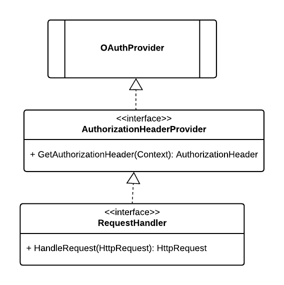
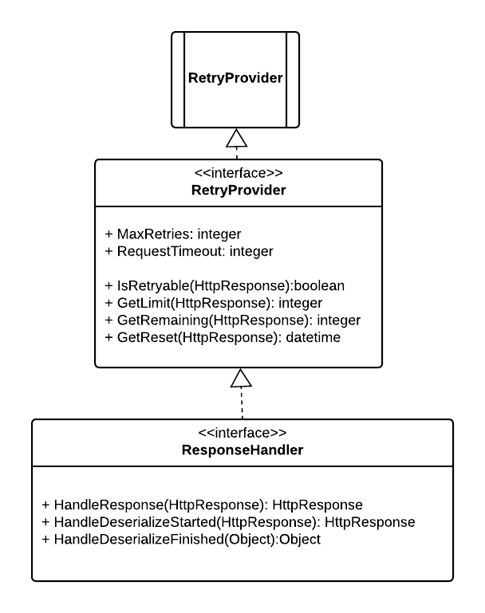

# Okta Python SDK v3
## (Draft) Technical Docs

# Overview
Beginning with version 3, the Okta Python SDK is generated using the `openapi-generator-cli`, see [https://openapi-generator.tech/](https://openapi-generator.tech/).  

# Customizations

In order to inject custom functionality into the request and response pipeline the templates used by the generator have been modified to emit events that a consumer may subscribe to before an API request is sent and after an API response is received.  This is intended to enable additional custom processing while limiting the need to modify the underlying client or SDK code.

The following depicts the API request lifecycle:

# Okta Sdk Class Model
The following is the Okta SDK class model:

## EventSource
The EventSource interface defines how a consumer of the SDK may add custom processing to the request and response pipeline.

## AuthorizationHeaderProvider
The `AuthorizationHeaderProvider` interface defines a mechanism that may be used to set the `Authorization` HTTP header.  This is intended to enable OAuth related implementations.

> This feature is in addition to the default behavior of the out of the box API client which handles auth settings through configuration.

## PaginationProvider
The `PaginationProvider` provides Okta specific handling of paged results.  

See reference documentation:
- [Pagination](https://developer.okta.com/docs/api/#pagination)

## RetryProvider
The `RetryProvider` provides Okta specific handling of rate limits.  

See reference documentation:

- [Check your rate limits with Okta's rate limit headers](https://developer.okta.com/docs/reference/rl-best-practices/#check-your-rate-limits-with-okta-s-rate-limit-headers)
- [API rate limits](https://help.okta.com/en-us/content/topics/security/api-rate-limits.htm)